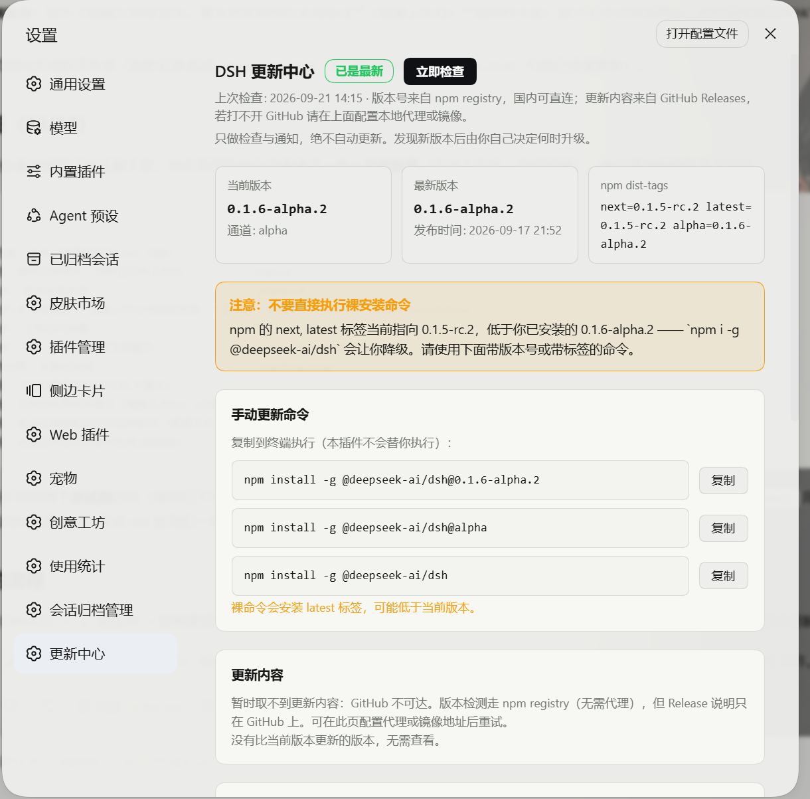
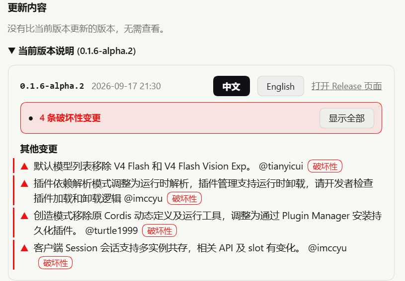
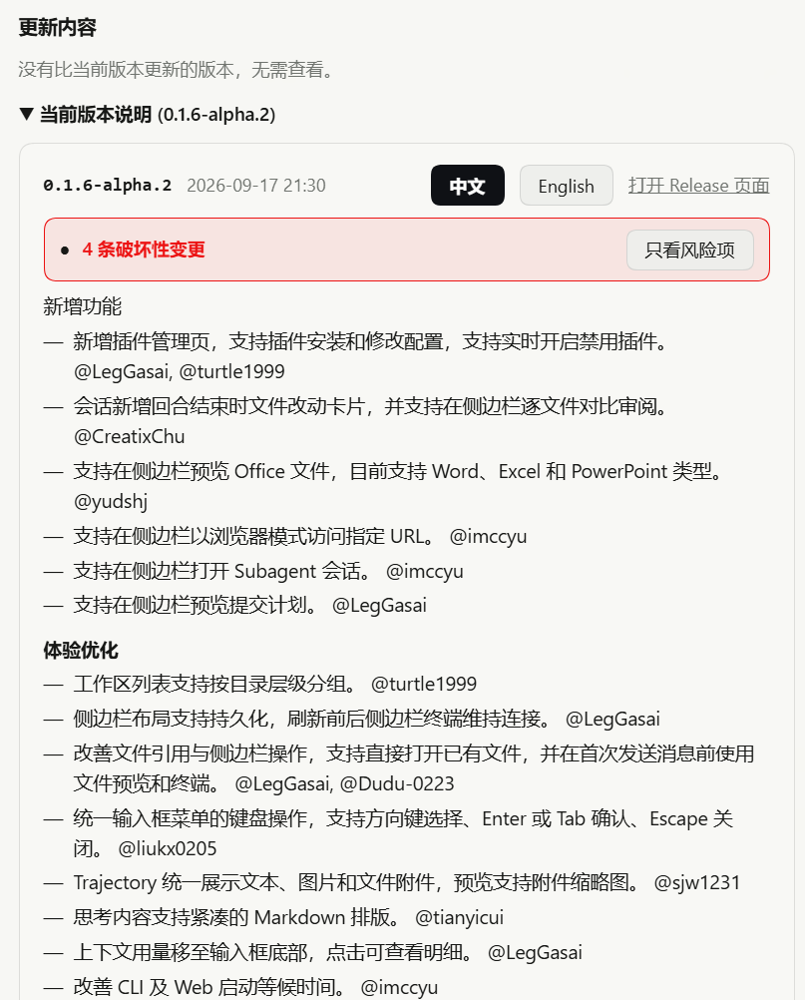
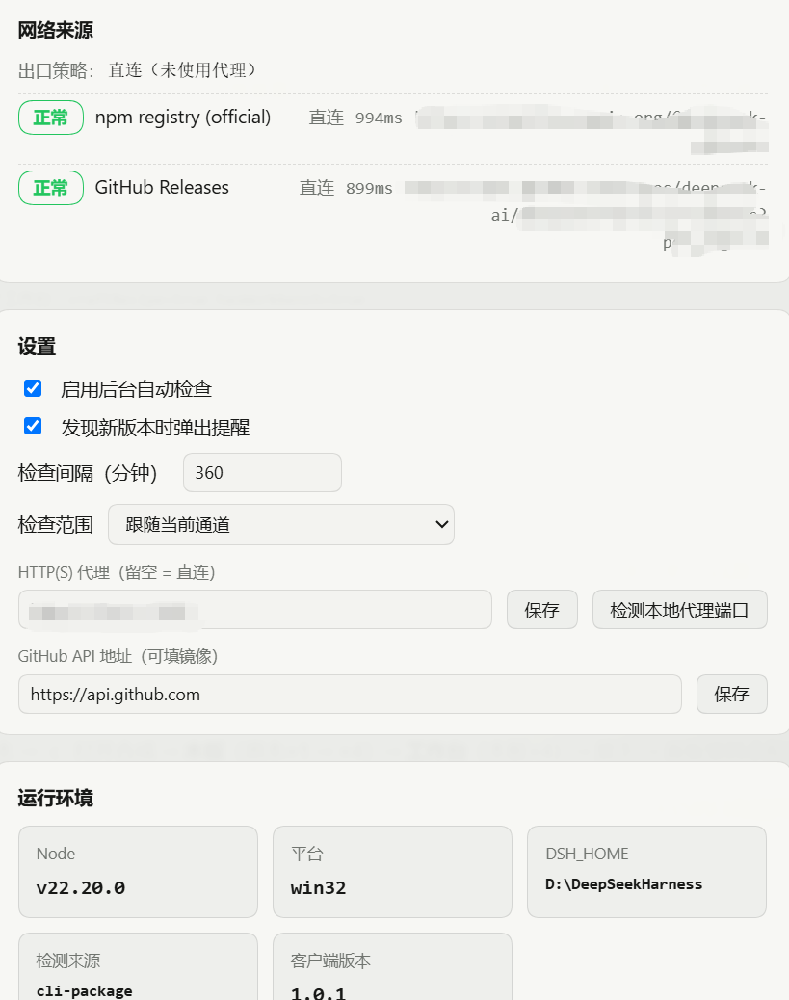

# dsh-update-lens

[](LICENSE)
[](https://github.com/topics/dsh-plugin)

> A **read-only** update checker for DeepSeek Harness (dsh): it shows the latest
> official version, the version you run, the release notes — and **flags the
> changes that could break what you already have**. It notifies you; it **never
> updates anything for you**.

[中文](README.md) · English

---

## Why

dsh ships often, and its release notes mix "new features" with "this package name
is no longer compatible, update your plugin". What you actually need is two
things: **is there a newer build**, and **will this update break what I rely on**.
This plugin answers those two and stops there. The upgrade command is offered to
copy — running it stays your decision.

## Where it lives

| Location | Contents |
| --- | --- |
| Settings → **Update center** (nav slot 160) | Installed / latest version, channel, npm dist-tags, release notes (zh/en), risk flags, network sources, settings, manual update commands |
| Bottom-right overlay | Appears when a newer version exists: "copy command / not now / ignore this version" |
| Settings nav entry | Becomes "Update center ●" while an update is available |

## Breaking-change annotation (the main difference from similar plugins)

Every bullet in the release notes is graded, shown with a coloured bar and a
badge; **hovering reveals the words that produced the verdict** — no black box:

| Tier | Meaning | Typical triggers |
| --- | --- | --- |
| ▲ **Breaking** (red) | Something is gone, no longer compatible, or you must act | 不兼容 no-longer-compatible, 移除/removed, 删除/deleted, 弃用/deprecated, 重命名/renamed, 必须/must, 请开发者检查 developers-should, 需适配 needs-adaptation, 需手动 manual |
| ! **Caution** (yellow) | Behaviour, defaults or interfaces moved | 调整/adjusted, 改为/changed-to, 上限/limit, 取消/removed-behaviour, 回滚/rollback, default, disable |

Two more rules:

- **Interface + change = breaking**: "with changes to related APIs and slots" —
  exactly what breaks a third-party plugin.
- **Section-aware noise control**: inside *Bug Fixes* and *New Features /
  Improvements* sections only top-tier words count, so "fixed a session that
  could not be restored" or "correct added/deleted line counts" are never flagged.

Per release you get an "N breaking / M to review" summary and an **Only flagged**
filter; when the version you would upgrade to carries breaking changes, a red bar
appears **above** the copyable command (the warning must be read before the line
you paste into a terminal).

The rules are not guesswork: `tests/notes-rules.mjs` runs 54 assertions against
**real release bodies** (`tests/fixtures/`), many of them negative — "this
look-alike sentence must stay quiet" — each one corresponding to a false positive
that actually happened.

## Install

```sh
# 1) into your profile (replace web with your profile name)
dsh plugin --profile web add github:1207627875/dsh-update-lens

# 2) enable it in Settings → Plugins, or add dsh-update-lens to that profile's
#    package.json dsh.profile.bundles array

# 3) restart the profile (Host-side code needs a restart; client changes need a page refresh)
```

Or let an AI assistant do it — paste this to any coding agent:

```text
Install the DeepSeek Harness (dsh) plugin dsh-update-lens:
1. In the active profile run: dsh plugin --profile <profile> add github:1207627875/dsh-update-lens
2. Add dsh-update-lens to dsh.profile.bundles in that profile's package.json
3. Restart the profile, then GET http://127.0.0.1:3080/dsh-update-lens/status and confirm the JSON
   returns and current.version equals my dsh version
```

Requires dsh `>= 0.1.6-alpha.2` (the only version this was tested on) and Node `>= 20`.

## Sources and network

| Source | Used for | Notes |
| --- | --- | --- |
| `registry.npmjs.org` | versions, dist-tags, publish times | primary |
| `registry.npmmirror.com` | same | fallback when the primary fails |
| `api.github.com/.../releases` | **release notes** | replaceable with a mirror you trust |

Comparison is real semver (including `alpha.2 < alpha.10` and
`0.1.6 > 0.1.6-alpha.2`). The default follows the channel you installed from;
you can switch to "newest across every channel". A **downgrade trap** — a
dist-tag pointing *below* your installed build — is called out separately.

**Proxy**: requests go direct by default and **ignore the system (WinINET)
proxy**, so a stale, dead proxy registration cannot break the check. Only two
things are honoured: the proxy you set on the page, or `HTTPS_PROXY` /
`HTTP_PROXY` in the launch environment. When proxying, the agent and the request
must come from the **same undici copy** (Node's built-in `fetch` rejects a
foreign `ProxyAgent` with `UND_ERR_INVALID_ARG`); if that cannot be arranged the
page says "proxy unusable, fell back to direct" rather than pretending. Each
source row shows whether that request went **direct or through the proxy**.

## Settings

- Background automatic check (on by default; first run 8 s after boot, never blocking)
- Interval (15 – 10080 minutes, default 360)
- Scope: follow the installed channel / newest across all channels
- Notify me when a newer version appears
- HTTP(S) proxy (empty = direct; `127.0.0.1:7890` is accepted without a scheme)
- GitHub API base (mirror allowed)
- Ignore this version (button in the notification)

State lives in `$DSH_HOME/dsh-update-lens/{config,state}.json` (`$DSH_HOME` defaults to `~/.dsh`).

## Screenshots

| Overview | Breaking-change annotation |
| --- | --- |
|  |  |

| Full notes + "only flagged" | Sources and settings |
| --- | --- |
|  |  |

Captured on a real install (dsh `0.1.6-alpha.2`). The bottom-right **notification**
shot can only be taken while a newer version actually exists; see
[`docs/SCREENSHOTS.md`](docs/SCREENSHOTS.md) for the capture list.

## Tests

```sh
node tests/encoding-check.mjs    # encoding guard: UTF-8 / BOM / mojibake / syntax
node tests/notes-rules.mjs       # annotation rules vs real release bodies (54 assertions)
node tests/proxy-path.mjs        # direct / dead-proxy / live-proxy behaviour
node tests/host-runtime.mjs      # version detection, downgrade trap, release notes
node tests/host-smoke.mjs        # routes, same-origin guard, real network, disposal
node tests/resolve-check.mjs     # install location: profile link, bundles list, client path
```

## What it is not

- **Not an updater.** No download, no replace, no global npm install. If you want
  one-click update with backup and rollback, use
  [Airmetro/dsh-update-checker](https://github.com/Airmetro/dsh-update-checker).
- **Only the dsh core**, not your installed third-party plugins; for that use
  [stuarthu/dsh-update-notifier](https://github.com/stuarthu/dsh-update-notifier)
  or a marketplace plugin. They do not conflict with this one.
- The annotation is a **keyword rule set**, not language understanding: every
  verdict is explainable (the matched words are shown), but a breaking change
  phrased without any signal will be missed, and strong wording can over-flag.
  Where the two languages disagree, the **worse** side wins.
- It only reads public data: every request is a GET, and the only write routes
  (`/check`, `/config`, `/dismiss`) touch this plugin's own config file and
  require a same-origin request.

## Encoding safety (development rule)

This repo carries a hard rule, learned from a real incident: a PowerShell bulk
replace read UTF-8 sources with the system ANSI code page and wrote them back as
UTF-8. Every Chinese string became mojibake, and `更新中心 ●` lost the `●` byte
which **swallowed the closing quote** — `SyntaxError: Invalid or unexpected
token`, i.e. a plugin that cannot load. Therefore:

1. sources, config and docs are UTF-8 **without BOM**;
2. text I/O must declare its encoding; PowerShell `Get-Content` / `Set-Content`
   without an explicit encoding must not touch files containing non-ASCII;
3. `node tests/encoding-check.mjs` must pass after any bulk edit, and `git diff`
   must be reviewed for mojibake before committing;
4. a `SyntaxError` means the work is not finished.

`.gitattributes` pins text-file line endings so Git cannot rewrite content across platforms.

## License

[MIT](LICENSE) © 2026 1207627875
